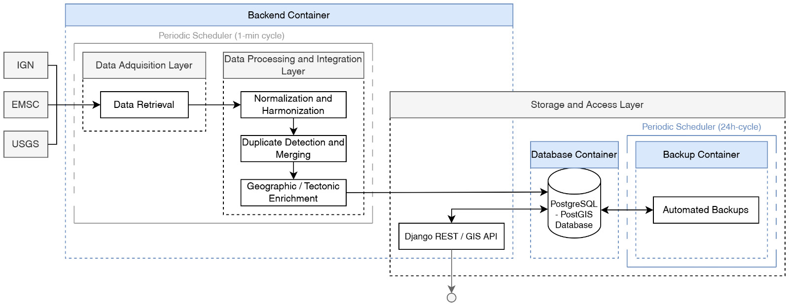

<div id="top"></div>

[![Contributors][contributors-shield]][contributors-url]
[![Forks][forks-shield]][forks-url]
[![Stargazers][stars-shield]][stars-url]
[![Issues][issues-shield]][issues-url]

<br/>

<div align="center">

  <div align="center">
  <h1><code>GLOBAL SEISMIC CATALOG</code></h1>
  </div>

  <p align="center">
    A fully automated and containerized framework for near-real-time integration of global seismic data from heterogeneous open sources.
    <br/>
    <a href="https://github.com/Josemelgahez/global-seismic-catalog/issues">Report a Bug</a>
    ·
    <a href="https://github.com/Josemelgahez/global-seismic-catalog/issues">Request a Feature</a>
  </p>
</div>

<details>
  <summary>Table of Contents</summary>
  <ol>
    <li><a href="#about-the-project">About the Project</a></li>
    <li><a href="#system-architecture">System Architecture</a></li>
    <li>
      <a href="#deployment-and-usage">Deployment and Usage</a>
      <ol>
        <li><a href="#requirements">Requirements</a></li>
        <li><a href="#deployment">Deployment</a></li>
        <li><a href="#usage">Usage</a></li>
        <li><a href="#data-export">Data Export</a></li>
        <li><a href="#backup-service">Backup Service</a></li>
      </ol>
    </li>
    <li><a href="#contact">Contact</a></li>
  </ol>
</details>


---

## About the Project

**Global Seismic Catalog (GSC)** is an open and fully automated framework for the near-real-time integration of global earthquake data from multiple authoritative sources. It provides a reproducible, containerized environment that continuously aggregates and harmonizes seismic events published by **[USGS](https://earthquake.usgs.gov)**, **[EMSC](https://www.seismicportal.eu)**, and **[IGN](https://www.ign.es)**, converting their heterogeneous data structures into a unified and interoperable catalog.

All events are automatically validated, normalized, and enriched with geographic and tectonic context before being stored in a spatially indexed PostgreSQL/PostGIS database. A REST API, implemented with the *Django REST Framework GIS*, exposes the harmonized catalog for direct use in analytical pipelines, visualization platforms, and external monitoring systems.


### Key Features

- Automated acquisition and synchronization of seismic events  
- Cross-source harmonization and validation of metadata  
- Spatial enrichment using tectonic plate and country boundaries  
- Deduplication based on temporal, spatial, and magnitude thresholds  
- REST API for real-time geospatial access  
- Containerized deployment ensuring full reproducibility  
- Automated backups and recovery

<p align="right">(<a href="#top">back to top</a>)</p>

---

## System Architecture

The system is composed of three main containers:

| Service | Description |
|----------|-------------|
| **app** | Django/PostGIS backend managing acquisition, harmonization, and API services |
| **db** | PostgreSQL/PostGIS database storing the unified event catalog |
| **backup** | Automated backup service ensuring database persistence |



<p align="right">(<a href="#top">back to top</a>)</p>

---

## Deployment and Usage

### Requirements

- **Docker** and **Docker Compose** installed.

> **Operating system considerations:**
>  - **Windows** and **macOS**: **Docker Desktop** must be installed and running before executing any Docker Compose commands.
>  - **Linux**: **Docker Engine** must be installed, and the `docker` service must be running before executing any Docker Compose commands (e.g., `sudo systemctl start docker`).

### Deployment

1. Clone the repository
   ```bash
   git clone https://github.com/Josemelgahez/global-seismic-catalog.git
   cd global-seismic-catalog
   ```

2. Build and start the containers
   ```bash
   docker compose up --build
   ```

### Usage

Once deployed via Docker Compose, the system operates fully autonomously. A background acquisition scheduler continuously queries the supported seismic data providers and ingests newly published or updated events without requiring user intervention.

Interaction with the unified seismic catalog is provided through the exposed service interfaces. The REST API enables access to the harmonized dataset, while an administrative web interface allows inspection of ingested events and system status:

- **API endpoint:** http://127.0.0.1:8000/api/  
- **Administrative interface:** http://127.0.0.1:8000/admin/  
> **Default administrative interface credentials:**  
> - Username: `admin`  
> - Password: `admin`

### Data Export

The unified seismic catalog can be exported directly from the running system using standard Django management commands. This enables full reproducibility of the catalog contents and facilitates offline analysis, archival, or integration into external research workflows.

1. Access the application container:
   ```bash
   docker exec -it seismic-app bash
   ```

2. Export database models to JSON format using `dumpdata`:
   ```bash
   python manage.py dumpdata api.Earthquake > /app/data/earthquakes.json
   python manage.py dumpdata api.CycleLog > /app/data/cycle_logs.json
   ```

> All exported files are written to the `/app/data/` directory inside the container, which is mapped by default to the `./data/` directory on the host system. This allows immediate access to the exported datasets without additional configuration.
>
> Additional models can be exported following the same pattern:
> ```bash
> python manage.py dumpdata api.<ModelName> > /app/data/<filename>.json
> ```

### Backup Service

Database backups are created automatically by the `backup` container and stored in the `/data/backups` directory. Each backup is timestamped for traceability and rotated periodically according to the configured retention policy.

By default, a new backup is generated every 24 hours (86,400 seconds), and older backups are automatically deleted once they exceed a retention period of seven days. These parameters can be modified through environment variables:
- `BACKUP_INTERVAL_SECONDS` controls how frequently backups are created.
- `BACKUP_RETENTION_DAYS` defines how long each backup is preserved before removal.

<p align="right">(<a href="#top">back to top</a>)</p>

---

## Contact

- Jose Melgarejo Hernández \
✉️ jose.melgarejo@ua.es

- Paula Margarita García-Tapia Mateo \
✉️ paula.garciatapia@ua.es

<p align="right">(<a href="#top">back to top</a>)</p>

<!-- https://www.markdownguide.org/basic-syntax/#reference-style-links -->
[contributors-shield]: https://img.shields.io/github/contributors/Josemelgahez/global-seismic-catalog?style=for-the-badge
[contributors-url]: https://github.com/Josemelgahez/global-seismic-catalog/graphs/contributors
[forks-shield]: https://img.shields.io/github/forks/Josemelgahez/global-seismic-catalog.svg?style=for-the-badge
[forks-url]: https://github.com/Josemelgahez/global-seismic-catalog/network/members
[stars-shield]: https://img.shields.io/github/stars/Josemelgahez/global-seismic-catalog.svg?style=for-the-badge
[stars-url]: https://github.com/Josemelgahez/global-seismic-catalog/stargazers
[issues-shield]: https://img.shields.io/github/issues/Josemelgahez/global-seismic-catalog.svg?style=for-the-badge
[issues-url]: https://github.com/Josemelgahez/global-seismic-catalog/issues